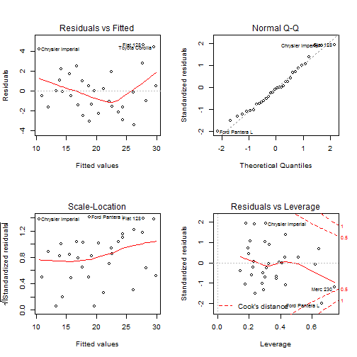
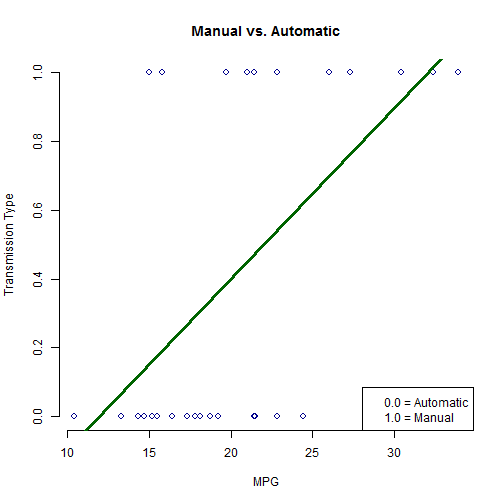

<!-- rmarkdown v1 -->

# Regression Models Course Project

### Executive Summary: 
The purpose of this assignment is to emulate working for Motor Trend, a magazine about the auto industry. By analyzing the dataset of a collection of cars, the company is interestedin exploring the relationship between a set of variables and the MPG. The two questions they are interested in answered are: 1. Is the automatic or manual transmission better for MPG, and 2. Quantifythe MPG difference between automatic and manual transmissions.


```r
# Read Data
data(mtcars)
```


```r
# Exploratory Analyses
dataAnalysis <- function(mtcars)
  {
    head(mtcars)
    dim(mtcars)
    str(mtcars)
    summary(mtcars)
  }

dataAnalysis(mtcars)
```

```
## 'data.frame':	32 obs. of  11 variables:
##  $ mpg : num  21 21 22.8 21.4 18.7 18.1 14.3 24.4 22.8 19.2 ...
##  $ cyl : num  6 6 4 6 8 6 8 4 4 6 ...
##  $ disp: num  160 160 108 258 360 ...
##  $ hp  : num  110 110 93 110 175 105 245 62 95 123 ...
##  $ drat: num  3.9 3.9 3.85 3.08 3.15 2.76 3.21 3.69 3.92 3.92 ...
##  $ wt  : num  2.62 2.88 2.32 3.21 3.44 ...
##  $ qsec: num  16.5 17 18.6 19.4 17 ...
##  $ vs  : num  0 0 1 1 0 1 0 1 1 1 ...
##  $ am  : num  1 1 1 0 0 0 0 0 0 0 ...
##  $ gear: num  4 4 4 3 3 3 3 4 4 4 ...
##  $ carb: num  4 4 1 1 2 1 4 2 2 4 ...
```

```
##       mpg             cyl             disp             hp       
##  Min.   :10.40   Min.   :4.000   Min.   : 71.1   Min.   : 52.0  
##  1st Qu.:15.43   1st Qu.:4.000   1st Qu.:120.8   1st Qu.: 96.5  
##  Median :19.20   Median :6.000   Median :196.3   Median :123.0  
##  Mean   :20.09   Mean   :6.188   Mean   :230.7   Mean   :146.7  
##  3rd Qu.:22.80   3rd Qu.:8.000   3rd Qu.:326.0   3rd Qu.:180.0  
##  Max.   :33.90   Max.   :8.000   Max.   :472.0   Max.   :335.0  
##       drat             wt             qsec             vs        
##  Min.   :2.760   Min.   :1.513   Min.   :14.50   Min.   :0.0000  
##  1st Qu.:3.080   1st Qu.:2.581   1st Qu.:16.89   1st Qu.:0.0000  
##  Median :3.695   Median :3.325   Median :17.71   Median :0.0000  
##  Mean   :3.597   Mean   :3.217   Mean   :17.85   Mean   :0.4375  
##  3rd Qu.:3.920   3rd Qu.:3.610   3rd Qu.:18.90   3rd Qu.:1.0000  
##  Max.   :4.930   Max.   :5.424   Max.   :22.90   Max.   :1.0000  
##        am              gear            carb      
##  Min.   :0.0000   Min.   :3.000   Min.   :1.000  
##  1st Qu.:0.0000   1st Qu.:3.000   1st Qu.:2.000  
##  Median :0.0000   Median :4.000   Median :2.000  
##  Mean   :0.4062   Mean   :3.688   Mean   :2.812  
##  3rd Qu.:1.0000   3rd Qu.:4.000   3rd Qu.:4.000  
##  Max.   :1.0000   Max.   :5.000   Max.   :8.000
```

```r
# linear model -- includes residual 
par(mfrow = c(2, 2))
fitMPG <- lm(mpg ~ .,data=mtcars); 
plot(fitMPG)
```




```r
# Linear Testing
plot(mtcars$mpg,mtcars$am,xlab="MPG",ylab="Transmission Type",main="Manual vs. Automatic",
     col="darkblue",cex=1.1,pch=21,frame=F)
lm1 <- lm(mtcars$am ~ mtcars$mpg)
abline(lm1,col="darkgreen",lwd=3)

legend('bottomright',c("0.0 = Automatic","1.0 = Manual"))
```




```r
# boxplot
boxplot(mpg ~ am,data=mtcars,fill="darkblue",col="lightblue"
        ,xlab="Transmission Type",ylab="MPG",frame=F)
legend('topleft',c("0: Automatic","1: Manual"))
```


```r
lmAuto <- lm(mtcars$mpg ~ mtcars$am)
summary(lmAuto)
```

```
## 
## Call:
## lm(formula = mtcars$mpg ~ mtcars$am)
## 
## Residuals:
##     Min      1Q  Median      3Q     Max 
## -9.3923 -3.0923 -0.2974  3.2439  9.5077 
## 
## Coefficients:
##             Estimate Std. Error t value Pr(>|t|)    
## (Intercept)   17.147      1.125  15.247 1.13e-15 ***
## mtcars$am      7.245      1.764   4.106 0.000285 ***
## ---
## Signif. codes:  0 '***' 0.001 '**' 0.01 '*' 0.05 '.' 0.1 ' ' 1
## 
## Residual standard error: 4.902 on 30 degrees of freedom
## Multiple R-squared:  0.3598,	Adjusted R-squared:  0.3385 
## F-statistic: 16.86 on 1 and 30 DF,  p-value: 0.000285
```

```r
t.test(mpg ~ am,data=mtcars)
```

```
## 
## 	Welch Two Sample t-test
## 
## data:  mpg by am
## t = -3.7671, df = 18.332, p-value = 0.001374
## alternative hypothesis: true difference in means is not equal to 0
## 95 percent confidence interval:
##  -11.280194  -3.209684
## sample estimates:
## mean in group 0 mean in group 1 
##        17.14737        24.39231
```

### Summary
Based on these tests, automatic transmission is better for your vehicle than automatic. Other factors could also cause these differences, but the average mpg differences between automatic and manual transmission are 17.15 for automatic and 24.40 for manual. If I were to test other factors in this analses, we may find that vehicle weight, fuel efficiency, and driving style may impact these results. The only thing I can conclude with high confidence is that there is a significant difference between miles per gallon between Automatic and Manual transmission types. (This data doesn't account for hybrid and alternative fuel types, or electric vehicles)
  
